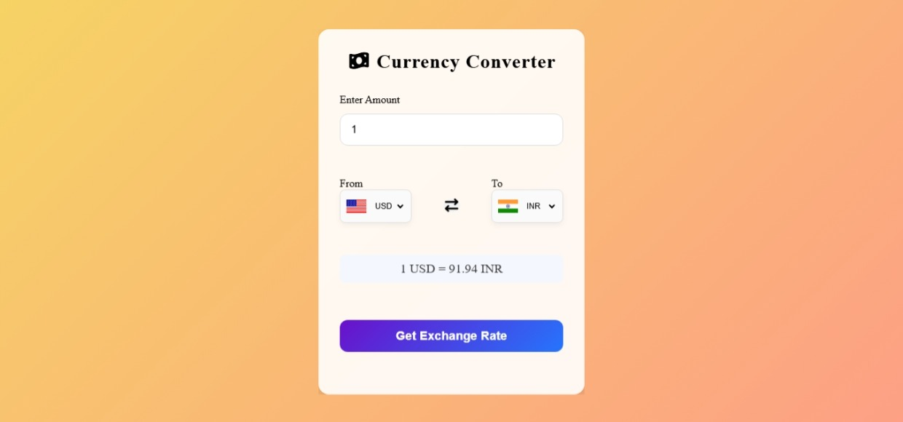

💱 Currency Converter

A modern Currency Converter Web Application built with HTML, CSS, and JavaScript that fetches real-time exchange rates using an API.
The application provides a clean user interface, currency flags, and responsive design for a smooth user experience across devices.

🌐 Live Demo

👉 https://rohan7207.github.io/Currency-Converter/

📸 Screenshot

✨ Features

- ⚡ Real-time currency conversion

- 🌍 Country flag display

- 🔄 Instant currency swap

- 📱 Fully responsive design

- 🎨 Smooth UI animations

⚙️ Technologies Used

- HTML5 – Structure of the application

- CSS3 – Styling and responsive design

- JavaScript (ES6) – Application logic and API integration

- Exchange Rate API – Fetching live currency conversion data

## 📂 Project Structure
Currency-Converter
│
├── index.html
├── style.css
├── script.js
├── codes.js
├── assets
│   └── screenshot.png
└── README.md

🚀 How It Works

1. Enter the amount to convert.

2. Select the source currency.

3. Select the target currency.

4. Click Get Exchange Rate.

5. The app fetches live data from the API.

6. The converted value is displayed instantly.

🔮 Future Improvements

- Search currency by country name

- Currency trend chart visualization

- Dark mode support

- Historical exchange rate data

## 👨‍💻 Author

**Rohan Figredo**

GitHub: https://github.com/Rohan7207

## ⭐ Support

If you like this project, please give it a **star ⭐ on GitHub**.